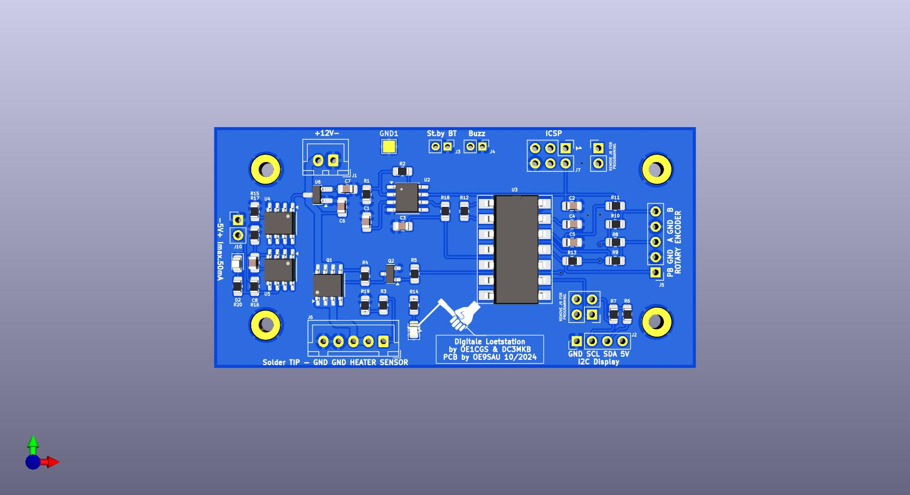
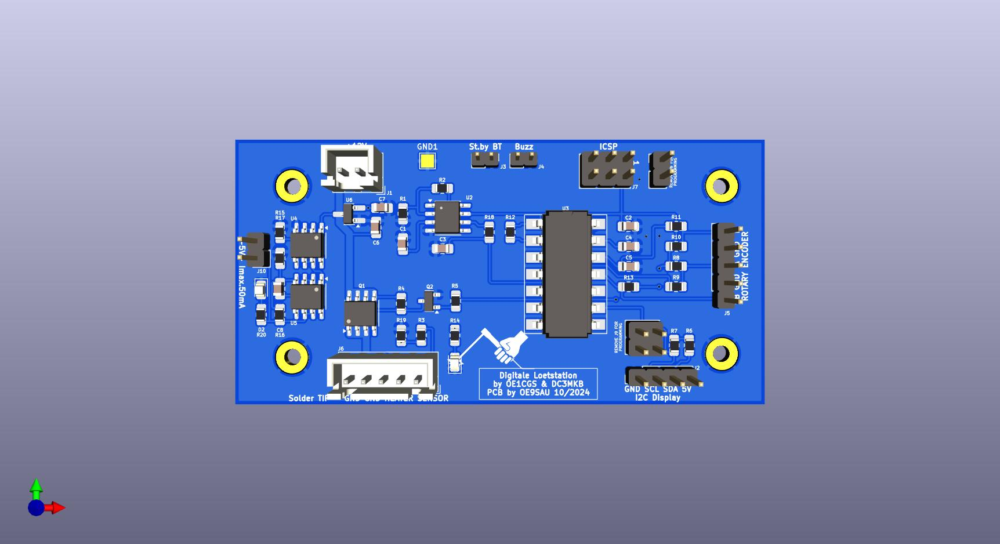

# Digitale Lötstation mit ATtiny 84
by DC3MKB [http://www.martin-kumm.de/wiki/doku.php?id=05Misc:SMD_Solderstation] und  
OE1CGS [http://www.oe1cgs.at/smd-loetstation/]  
Fork and PCB Design by OE9SAU

