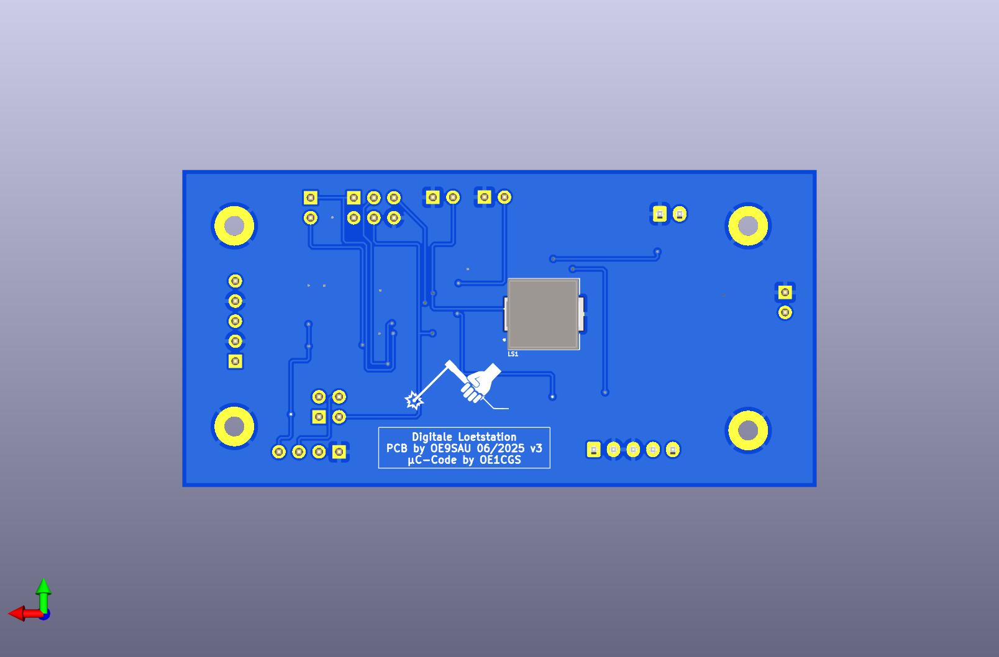

# Digitale Lötstation mit ATtiny 84 v2
PCB design by OE9SAU  
µC-Code and STL-Desing by OE1CGS [http://www.oe1cgs.at/smd-loetstation/]  

Soldering Unit for Weller RT solder tips.  
Current PCB version is also including a small 5V/50mA (max100mA) powersupply for the first power on trials.  

