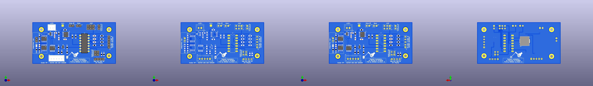

# Digitale Lötstation mit ATtiny 84 v1
by OE1CGS [http://www.oe1cgs.at/smd-loetstation/]  
and DC3MKB [http://www.martin-kumm.de/wiki/doku.php?id=05Misc:SMD_Solderstation]  
Fork and PCB Design by OE9SAU

